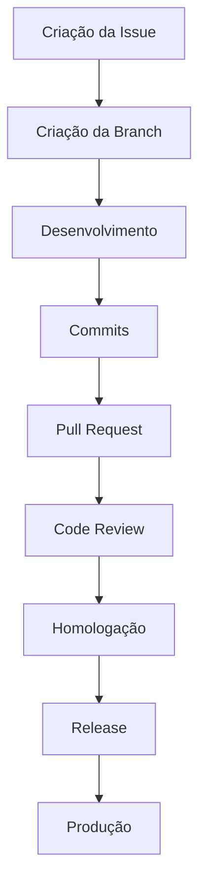

# 📚 Guia de Engenharia de Software

> Bem-vindo ao **Guia Oficial de Engenharia de Software** da equipe.

> Esta documentação define os padrões, processos e boas práticas adotados durante o desenvolvimento dos projetos. Seu objetivo é garantir consistência entre os repositórios, facilitar o onboarding de novos integrantes e promover entregas com maior qualidade, previsibilidade e rastreabilidade.

---

# 🎯 Objetivo

Este repositório centraliza toda a documentação utilizada pelo time de desenvolvimento.

Ao seguir estes padrões, buscamos:

* Padronizar o processo de desenvolvimento entre todos os integrantes;
* Facilitar a colaboração e o code review;
* Melhorar a rastreabilidade das alterações;
* Automatizar processos utilizando as ferramentas do GitHub;
* Reduzir retrabalho e inconsistências;
* Tornar o onboarding de novos desenvolvedores mais rápido.

> ✅ **Boa prática**
>
> A documentação deve ser considerada parte do produto. Sempre que um processo evoluir ou uma nova convenção for adotada, este guia também deve ser atualizado.

---

# 🧭 Como utilizar esta documentação

Cada assunto foi separado em um documento específico para facilitar a consulta e a manutenção.

Leia os documentos na ordem abaixo durante o onboarding e utilize-os como referência durante o desenvolvimento.

| Documento                     | Descrição                                                                                                       |
| ----------------------------- | --------------------------------------------------------------------------------------------------------------- |
| 📖 **Introdução**             | Objetivos, escopo, princípios da equipe e visão geral do processo de desenvolvimento.                           |
| 🌳 **Padrões Git**            | Convenções de repositórios, branches, commits, Pull Requests, Code Review, estratégia de merge e versionamento. |
| 📋 **Organização do Projeto** | Estruturação das atividades, Issues, GitHub Projects, Kanban e organização das entregas.                        |
| 📝 **Templates**              | Modelos oficiais utilizados pela equipe para Issues, Pull Requests e demais artefatos.                          |
| 💡 **Exemplos**               | Exemplos práticos de branches, commits, Pull Requests, fluxo de desenvolvimento e boas práticas.                |

---

# 📂 Estrutura da documentação

```text
.
├── README.md
└── docs
    ├── introducao.md
    ├── padroes-git.md
    ├── organizacao-projeto.md
    ├── templates.md
    └── exemplos.md
```

---

# 🔄 Fluxo de Desenvolvimento

O fluxo de trabalho adotado pela equipe pode ser resumido da seguinte forma:



Cada etapa possui regras específicas documentadas nos arquivos desta documentação.

---

# 📚 Documentação

## 📖 Introdução

Apresenta a visão geral da engenharia da equipe, seus objetivos, princípios e escopo da documentação.

> **Arquivo:** [docs/introducao.md](docs/introducao.md)

---

## 🌳 Padrões Git

Define todas as convenções relacionadas ao uso do Git e do GitHub, incluindo:

* Organização de repositórios;
* Estratégia de branches;
* Conventional Commits;
* Pull Requests;
* Code Review;
* Merge Strategy;
* Semantic Versioning;
* Releases.

> **Arquivo:** [docs/padroes-git.md](docs/padroes-git.md)

---

## 📋 Organização do Projeto

Documenta a forma como as atividades são planejadas e acompanhadas.

Inclui:

* Estruturação de Épicos e Tasks;
* Organização das Issues;
* GitHub Projects;
* Fluxo Kanban;
* Registro de horas.

> **Arquivo:** [docs/organizacao-projeto.md](docs/organizacao-projeto.md)

---

## 📝 Templates

Reúne os modelos oficiais utilizados durante o desenvolvimento.

Exemplos:

* Templates de Issues;
* Templates de Pull Requests;
* Checklists.

> **Arquivo:** [docs/templates.md](docs/templates.md)

---

## 💡 Exemplos

Contém exemplos práticos utilizados como referência para o time.

Exemplos de:

* Branches;
* Commits;
* Pull Requests;
* Releases;
* Fluxos completos de desenvolvimento.

> **Arquivo:** [docs/exemplos.md](docs/exemplos.md)

---

# 🤝 Contribuindo

Toda alteração nesta documentação deve seguir os mesmos padrões definidos para os demais projetos da equipe.

Sempre que uma nova convenção for adotada, a documentação correspondente deverá ser atualizada para refletir o processo vigente.

> ⚠️ **Importante**
>
> Este guia representa a referência oficial da equipe para processos de engenharia de software. Em caso de divergência entre a documentação e uma prática adotada durante o desenvolvimento, a documentação deve ser revisada para manter ambos alinhados.

---

# 🚀 Próximos passos

Caso esta seja sua primeira contribuição para a equipe, recomenda-se realizar a leitura na seguinte ordem:

1. [docs/introducao.md](docs/introducao.md)
2. [docs/padroes-git.md](docs/padroes-git.md)
3. [docs/organizacao-projeto.md](docs/organizacao-projeto.md)
4. [docs/templates.md](docs/templates.md)
5. [docs/exemplos.md](docs/exemplos.md)

Ao finalizar a leitura, você estará apto a seguir o fluxo de desenvolvimento adotado pela equipe e contribuir de forma consistente com os padrões estabelecidos.
