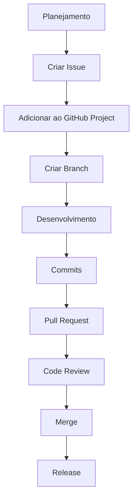
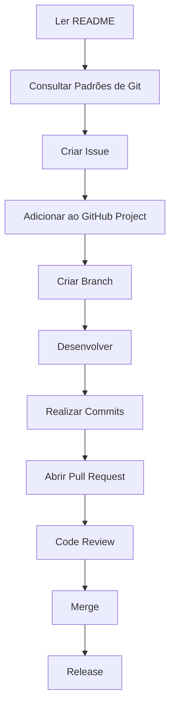

# 🚀 Guia Prático

> Este documento apresenta exemplos práticos de utilização dos padrões definidos neste handbook.
>
> O objetivo é demonstrar, passo a passo, como aplicar o fluxo de desenvolvimento adotado pela equipe, desde o planejamento de uma atividade até sua integração ao projeto.

---

# Sumário

1. Fluxo completo de desenvolvimento
2. Exemplo: Desenvolvendo uma nova funcionalidade
3. Exemplo: Corrigindo um bug
4. Exemplo: Atualizando a documentação
5. Exemplos rápidos
6. Fluxo geral da equipe

---

# 1. Fluxo completo de desenvolvimento

Todo desenvolvimento realizado pela equipe deverá seguir o fluxo abaixo.



Cada etapa possui um objetivo específico e contribui para garantir qualidade, rastreabilidade e organização do projeto.

---

# 2. Exemplo: Desenvolvendo uma nova funcionalidade

Neste exemplo será implementado o login utilizando GitHub OAuth.

---

## Passo 1 — Criar a Issue

Título

```text
[EPICO:003] [TASK] Implementar autenticação OAuth com GitHub
```

Descrição

```markdown
## Descrição

Implementar autenticação utilizando OAuth do GitHub.

## Motivação

Precisamos criar essa autenticação para acesso a aplicação.

## Quem se beneficia

Usuários do app.

## Solução proposta

Fazer a autenticação usando a autenticação em OAuth Apps no GitHub.

## Registro de horas

Ao trabalhar nessa issue, registre o tempo gasto em um comentário seguindo o formato abaixo

Exemplo:

+2h30m

Comentário
```

---

## Passo 2 — Adicionar ao GitHub Projects

Atualize os principais campos.

| Campo       | Valor         |
| ----------- | ------------- |
| Status      | Backlog       |
| Prioridade  | P1            |
| Tipo        | Task          |
| Estimativa  | 240 minutos   |
| Responsável | Desenvolvedor |

---

## Passo 3 — Criar a Branch

```text
feature/github-oauth
```

---

## Passo 4 — Desenvolver

Durante o desenvolvimento, mantenha commits pequenos e objetivos.

Exemplo:

```text
feat(auth): adiciona configuração OAuth

feat(auth): implementa callback do GitHub

test(auth): adiciona testes do fluxo OAuth
```

---

## Passo 5 — Abrir Pull Request

Título

```text
feat(auth): implementa autenticação OAuth
```

Descrição

```markdown
## Descrição

Implementação da autenticação com OAuth 2.0.

## Tipo de Mudança

> Marque com `x` todas as opções que se aplicam.

- [ ] 🐛 **Bug fix** — corrige um erro sem quebrar funcionalidades existentes
- [X] ✨ **Nova feature** — adiciona uma funcionalidade sem quebrar as existentes
- [ ] 💥 **Breaking change** — mudança que pode impactar funcionalidades existentes
- [ ] 🎨 **Refatoração / melhoria de código** — sem alteração de comportamento
- [ ] 📝 **Documentação** — apenas mudanças em docs
- [ ] 🧪 **Testes** — adição ou correção de testes
- [ ] 🔧 **Configuração / build** — mudanças em CI, scripts, dependências


## Checklist

> Verifique todos os itens antes de solicitar revisão.

- [X] Meu código segue o padrão de estilo do projeto
- [X] Realizei uma auto-revisão do meu código
- [X] Comentei partes complexas do código (se necessário)
- [X] Minhas mudanças não geram novos warnings ou erros
- [X] Adicionei testes que comprovam o funcionamento da feature/fix
- [X] Todos os testes existentes passam localmente
- [X] Atualizei a documentação (README, wiki, etc.), se necessário
- [X] Variáveis de ambiente novas foram documentadas

## Como Testar

> Descreva o passo a passo para que o revisor consiga testar suas mudanças localmente.

1.Entre no aplicativo mobile
2.Aperte em logar com github
3.Verifique se funcionou

## Uso consciente de Inteligência Artificial

Usei a IA para tarefas pequenas e pontuais para sintaxe e algumas decisões.
```

---

## Passo 6 — Code Review

Após abrir o Pull Request:

* responder comentários;
* realizar ajustes solicitados;
* atualizar a branch quando necessário;
* solicitar nova revisão.

---

## Passo 7 — Merge

Após aprovação:

* realizar Merge;
* verificar fechamento automático da Issue;
* atualizar GitHub Project.

---

## Passo 8 — Registro de Horas

Registrar na Issue.

```text
+2h30m

Implementação completa da autenticação OAuth utilizando GitHub.
```

---

# 3. Exemplo: Corrigindo um Bug

Fluxo simplificado.

Criar Issue.

```text
🐛 Bug Report

Erro HTTP 500 durante autenticação.
```

Criar Branch.

```text
bugfix/login-500
```

Commit.

```text
fix(auth): corrige exceção durante autenticação
```

Abrir Pull Request.

```text
fix(auth): corrige erro HTTP 500 no login
```

Merge.

Atualizar GitHub Project.

Registrar horas.

```text
+45m

Correção do tratamento de exceção.
```

---

# 4. Exemplo: Atualizando a documentação

Criar Issue.

```text
📚 Documentation

Atualizar documentação do processo de autenticação.
```

Branch.

```text
docs/oauth-documentation
```

Commit.

```text
docs(auth): atualiza documentação OAuth
```

Pull Request.

```text
docs(auth): adiciona documentação da autenticação OAuth
```

Merge.

Registrar horas.

```text
+30m

Atualização da documentação.
```

---

# 5. Exemplos rápidos

## Branches

```text
feature/dashboard

feature/oauth

bugfix/login

bugfix/database

docs/readme

hotfix/auth

refactor/user-service

chore/dependencies
```

---

## Commits

```text
feat(api): adiciona endpoint de usuários

fix(auth): corrige validação do JWT

docs(readme): atualiza instalação

refactor(database): simplifica consultas

test(auth): adiciona testes unitários

chore(deps): atualiza dependências
```

---

## Pull Requests

```text
feat(api): implementa CRUD de usuários

fix(auth): corrige erro de autenticação

docs(api): atualiza documentação

refactor(api): reorganiza camada de serviços
```

---

## Registro de Horas

```text
+30m

Atualização da documentação.
```

```text
+2h

Implementação da autenticação.
```

```text
+45m

Code Review do PR #28.
```

---

# 6. Fluxo geral da equipe

O diagrama abaixo resume o fluxo de trabalho adotado pela equipe.



---

# Conclusão

Seguir este fluxo garante que todas as entregas sejam desenvolvidas de maneira consistente, rastreável e alinhada aos padrões definidos pela equipe.

Em caso de dúvidas sobre qualquer etapa do processo, consulte os documentos específicos deste handbook:

* **README.md** — Visão geral da documentação.
* **docs/padroes-git.md** — Padrões de Git e GitHub.
* **docs/organizacao-projeto.md** — Organização das atividades.
* **docs/templates.md** — Templates de Issues e Pull Requests.