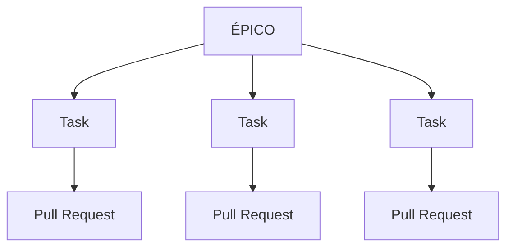
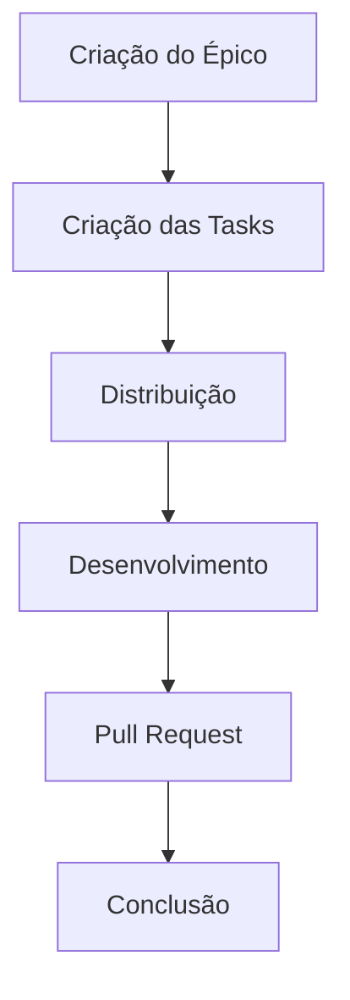
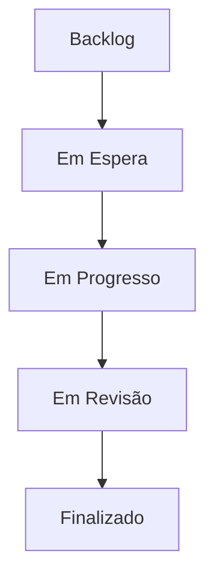
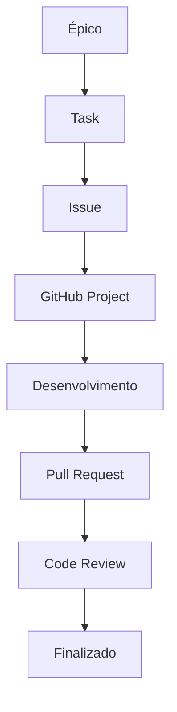

# 📋 Organização do Projeto

> Este documento define como a equipe organiza, acompanha e executa suas atividades durante o desenvolvimento dos projetos.
>
> O objetivo é estabelecer um fluxo padronizado para planejamento, execução e acompanhamento das entregas, garantindo maior organização, rastreabilidade e previsibilidade durante o desenvolvimento.

---

# Sumário

1. Organização das Atividades

   * 1.1 Objetivo
   * 1.2 Hierarquia das atividades
   * 1.3 Épicos
   * 1.4 Tasks
2. Issues

   * 2.1 Objetivo
   * 2.2 Tipos de Issues
   * 2.3 Estrutura de uma Issue
   * 2.4 Organização das Issues
   * 2.5 Relacionamento entre Issues
   * 2.6 Boas práticas
   * 2.7 Erros comuns
3. GitHub Projects

   * 3.1 Fluxo Kanban
   * 3.2 Campos do GitHub Projects
   * 3.3 Registro de Horas
   * 3.4 Boas práticas
   * 3.5 Erros comuns

---

# 1. Organização das Atividades

## 1.1 Objetivo

Toda atividade realizada pela equipe deverá estar registrada no GitHub antes do início do desenvolvimento.

Isso permite que qualquer integrante consiga responder perguntas como:

* O que está sendo desenvolvido?
* Quem é o responsável?
* Qual o objetivo da atividade?
* Qual a prioridade?
* Em qual etapa do fluxo ela se encontra?
* Quanto tempo foi investido?

Além disso, esse processo permite acompanhar a evolução do projeto e gerar métricas que auxiliam na melhoria contínua da equipe.

> ℹ️ **Por que registrar todas as atividades?**
>
> Em equipes de desenvolvimento, conhecimento que existe apenas em conversas tende a se perder com o tempo. Registrar as atividades garante rastreabilidade, facilita o planejamento e cria um histórico confiável das decisões tomadas ao longo do projeto.

---

## 1.2 Hierarquia das atividades

As atividades da equipe seguem uma estrutura hierárquica.



Cada nível possui uma responsabilidade específica.

| Nível     | Responsabilidade                                                              |
| --------- | ----------------------------------------------------------------------------- |
| **Épico** | Representa um objetivo maior ou uma entrega significativa do projeto.         |
| **Task**  | Representa uma atividade técnica necessária para atingir o objetivo do Épico. |

Essa organização permite dividir funcionalidades grandes em entregas menores, facilitando o acompanhamento e a distribuição do trabalho entre os integrantes da equipe.

> ✅ **Boa prática**
>
> Sempre que uma atividade puder ser dividida em partes independentes, prefira criar um Épico contendo diversas Tasks menores ao invés de uma única atividade muito grande.

---

## 1.3 Épicos

### O que é um Épico?

Um **Épico** representa uma entrega de alto nível do projeto.

Normalmente corresponde a uma funcionalidade completa, um módulo do sistema ou qualquer iniciativa que exija diversas atividades menores para sua conclusão.

Exemplos:

* Desenvolvimento do módulo de autenticação;
* Construção do banco de dados;
* Implementação da integração com GitHub;
* Desenvolvimento do painel administrativo.

Cada Épico funciona como um agrupador de Tasks relacionadas.

---

### Quando criar um Épico?

Um Épico deve ser criado sempre que a funcionalidade:

* exigir vários dias de desenvolvimento;
* envolver mais de uma Task;
* puder ser dividida entre diferentes integrantes;
* representar uma entrega importante para o projeto.

Caso a atividade seja pequena e possa ser concluída de forma independente, não há necessidade de criar um Épico.

---

### Estrutura de um Épico

Todo Épico deverá possuir:

* título padronizado;
* descrição do objetivo;
* Tasks relacionadas;
* campos do kanban preenchidos.

---

### Convenção de nomenclatura

Os Épicos deverão seguir a seguinte convenção:

```text
[EPICO:001] Construção do Banco de Dados
```

A numeração deverá ser sequencial dentro do projeto.

Exemplos:

```text
[EPICO:001] Banco de Dados

[EPICO:002] API REST

[EPICO:003] Dashboard Administrativo
```

Essa identificação facilita a associação entre Épicos e suas respectivas Tasks.

> ℹ️ **Observação**
>
> A numeração não representa prioridade. Ela serve apenas como identificador único para facilitar a organização e a rastreabilidade das atividades.

---

### Relacionamento entre Épicos e Tasks

Todas as Tasks pertencentes a um Épico deverão ser vinculadas utilizando o recurso de **Sub-issues** do GitHub.

Essa abordagem oferece diversos benefícios:

* facilita o acompanhamento da evolução da funcionalidade;
* centraliza todas as atividades relacionadas;
* permite visualizar automaticamente o progresso do Épico;
* evita perda de contexto entre tarefas relacionadas.

Exemplo:

```text
[EPICO:004] Sistema de Autenticação

├── [TASK] Modelagem das tabelas
├── [TASK] Endpoint de Login
├── [TASK] Integração OAuth
└── [TASK] Testes Automatizados
```

---

## 1.4 Tasks

### O que é uma Task?

Uma **Task** representa uma atividade técnica específica que pode ser executada por um integrante da equipe.

Ela deve possuir um objetivo claro e produzir uma entrega bem definida.

Enquanto o Épico representa **"o que queremos entregar"**, a Task representa **"o trabalho necessário para chegar até essa entrega"**.

---

### Quando criar uma Task?

Uma Task deve ser criada sempre que existir uma atividade técnica executável de forma independente.

Exemplos:

* criar uma tabela;
* implementar um endpoint;
* desenvolver uma tela;
* escrever testes automatizados;
* atualizar uma documentação;
* configurar um pipeline.

---

### Convenção de nomenclatura

As Tasks relacionadas a um Épico deverão seguir o padrão:

```text
[EPICO:004] [TASK] - Criar Endpoint de Login
```

Exemplos:

```text
[EPICO:004] [TASK] - Criar tabela de usuários

[EPICO:004] [TASK] - Implementar autenticação JWT

[EPICO:004] [TASK] - Desenvolver tela de Login
```

Quando uma Task não estiver relacionada a um Épico específico, o identificador do Épico poderá ser omitido.

Exemplo:

```text
[TASK] - Atualizar documentação do projeto
```

---

### Características de uma boa Task

Uma Task bem escrita deve possuir:

* objetivo claro;
* escopo limitado;
* responsável definido;
* critérios de aceitação;
* estimativa de esforço.

Evite criar Tasks muito amplas ou com múltiplos objetivos.

Exemplo inadequado:

```text
[TASK] - Desenvolver sistema inteiro
```

Exemplo recomendado:

```text
[TASK] - Implementar endpoint de autenticação

[TASK] - Criar tela de login

[TASK] - Desenvolver testes de autenticação
```

> ✅ **Boa prática**
>
> Uma boa Task normalmente pode ser concluída em poucos dias de trabalho. Caso uma atividade se torne muito grande, considere dividi-la em Tasks menores para facilitar o acompanhamento, a revisão e a entrega incremental.

---

### Fluxo das atividades

O fluxo de planejamento da equipe segue a sequência abaixo:



Todo o desenvolvimento da equipe deverá seguir esse fluxo antes da integração do código ao projeto.

---

# 2. Issues

As **Issues** representam a unidade oficial de trabalho da equipe.

Toda atividade que demande planejamento, desenvolvimento, correção, documentação ou manutenção deverá ser registrada como uma Issue antes do início da implementação.

Essa abordagem garante rastreabilidade, facilita o acompanhamento das entregas e permite que todo o histórico de desenvolvimento permaneça centralizado no GitHub.

> ℹ️ **Por que utilizar Issues?**
>
> Centralizar o trabalho em Issues evita que atividades sejam esquecidas, melhora o planejamento da equipe e cria um histórico completo das decisões tomadas durante o desenvolvimento.

---

## 2.1 Objetivo

As Issues possuem diferentes finalidades durante o ciclo de desenvolvimento.

Elas permitem:

* Planejar funcionalidades;
* Registrar problemas;
* Organizar tarefas técnicas;
* Documentar melhorias;
* Controlar prioridades;
* Registrar tempo trabalhado;
* Automatizar o fluxo do GitHub Projects.

Toda alteração realizada no projeto deverá estar relacionada a uma Issue.

> ⚠️ **Importante**
>
> Não é permitido desenvolver funcionalidades diretamente sem uma Issue correspondente, exceto em situações emergenciais previamente alinhadas com a equipe.

---

## 2.2 Tipos de Issues

Cada atividade possui um propósito diferente.

Por esse motivo, a equipe utiliza templates específicos para cada tipo de Issue.

| Tipo              | Quando utilizar                        | Label aplicada  |
| ----------------- | -------------------------------------- | --------------- |
| ✨ Feature Request | Nova funcionalidade                    | `feature`       |
| 🐛 Bug Report     | Correção de erro                       | `bug`           |
| 📌 Task           | Atividade técnica                      | `task`          |
| 📚 Documentation  | Criação ou atualização de documentação | `documentation` |
| ⚡ Performance     | Melhorias de desempenho                | `performance`   |
| 🔒 Security       | Vulnerabilidades de segurança          | `security`      |
| 🧪 Test           | Desenvolvimento ou melhoria de testes  | `test`          |

Cada template foi projetado para coletar apenas as informações necessárias para aquele tipo de atividade.

---

## 2.3 Estrutura de uma Issue

Independentemente do template utilizado, algumas informações são consideradas essenciais.

### Campos obrigatórios

Toda Issue deverá conter, no mínimo:

| Campo             | Obrigatório |
| ----------------- | :---------: |
| Descrição         |      ✅      |
| Motivação         |      ✅      |
| Registro de Horas |      ✅      |

Esses campos garantem que qualquer integrante consiga compreender rapidamente o contexto da atividade.

---

### Campos opcionais

Dependendo da complexidade da atividade, recomenda-se adicionar:

* Critérios de aceitação;
* Impactos esperados;
* Dependências;
* Links úteis;
* Diagramas;
* Mockups;
* Referências.

Essas informações facilitam tanto o desenvolvimento quanto o Code Review.

---

## 2.4 Organização das Issues

Todas as Issues deverão estar vinculadas ao repositório onde a implementação será realizada.

Isso evita perda de contexto e garante que o histórico técnico permaneça próximo ao código-fonte.

> ❌ Não recomendado
>
> Criar uma Issue em um repositório apenas por conveniência e implementar a funcionalidade em outro.

> ✅ Recomendado
>
> Cada repositório deve concentrar suas próprias atividades, documentação e histórico de desenvolvimento.

---

## 2.5 Relacionamento entre Issues

Sempre que uma atividade fizer parte de outra maior, utilize os recursos nativos do GitHub para estabelecer esse relacionamento.

Exemplo:

```text id="q6eq0l"
[EPICO:007] - Sistema de Autenticação

├── [TASK] - Criar tabela de usuários
├── [TASK] - Desenvolver endpoint de login
├── [TASK] - Implementar autenticação OAuth
└── [TASK] - Criar testes automatizados
```

Essa organização facilita o acompanhamento da evolução do projeto e permite visualizar automaticamente o progresso do Épico.

---

## 2.6 Boas práticas

Durante a criação de uma Issue, procure seguir as recomendações abaixo.

* Utilize títulos objetivos;
* Escreva descrições claras;
* Mantenha o escopo limitado;
* Utilize o template correto;
* Relacione a Issue ao respectivo Épico (quando existir);
* Atualize a Issue conforme o desenvolvimento evoluir;
* Registre as horas trabalhadas ao longo da execução.

> ✅ **Boa prática**
>
> Uma Issue deve responder todas as dúvidas necessárias para iniciar o desenvolvimento sem depender de explicações adicionais.

---

## 2.7 Erros comuns

| Evite                                    | Motivo                                        |
| ---------------------------------------- | --------------------------------------------- |
| Criar Issues muito genéricas             | Dificulta planejamento e acompanhamento       |
| Misturar vários objetivos na mesma Issue | Complica estimativas e revisões               |
| Utilizar template incorreto              | Reduz a qualidade das informações registradas |
| Não registrar horas trabalhadas          | Prejudica as métricas do projeto              |
| Desenvolver sem Issue                    | Perde rastreabilidade                         |

---

# 3. GitHub Projects

O **GitHub Projects** é a ferramenta oficial utilizada pela equipe para planejar, organizar e acompanhar o andamento das atividades durante todo o ciclo de desenvolvimento.

Todas as Issues deverão estar vinculadas ao Project correspondente ao seu repositório.

Além de centralizar o planejamento do projeto, o GitHub Projects permite acompanhar indicadores importantes, como progresso das entregas, distribuição das atividades, prioridades e tempo investido em cada tarefa.

> ℹ️ **Por que utilizar o GitHub Projects?**
>
> O GitHub Projects integra Issues, Pull Requests e automações em um único ambiente, reduzindo a necessidade de ferramentas externas e mantendo todo o histórico do projeto centralizado no GitHub.

---

## 3.1 Fluxo Kanban

A equipe utiliza a metodologia **Kanban** para organizar o fluxo de desenvolvimento.

Cada coluna representa uma etapa do ciclo de vida de uma atividade.



O objetivo desse fluxo é tornar o andamento das atividades visível para toda a equipe, permitindo identificar gargalos rapidamente e facilitar o planejamento das entregas.

---

### Backlog

Representa todas as atividades registradas que ainda não foram iniciadas.

Normalmente encontram-se nessa coluna tarefas que aguardam priorização ou definição de responsável.

Uma atividade pode permanecer no Backlog por tempo indeterminado.

---

### Em Espera

Utilizada para atividades que não podem prosseguir temporariamente.

Alguns exemplos:

* dependência de outra Task;
* aguardando validação;
* aguardando resposta do cliente;
* aguardando definição técnica.

> ⚠️ **Importante**
>
> Sempre que uma atividade for movida para **Em Espera**, recomenda-se registrar o motivo na própria Issue para facilitar o acompanhamento da equipe.

---

### Em Progresso

Representa atividades que estão sendo desenvolvidas ativamente.

Ao mover uma atividade para esta coluna, recomenda-se que:

* exista um responsável definido;
* a data de início seja preenchida;
* a estimativa esteja revisada.

---

### Em Revisão

Representa atividades cujo desenvolvimento foi concluído e que aguardam aprovação através do processo de Code Review.

Uma Issue somente deverá entrar nesta coluna quando existir um Pull Request aberto.

---

### Finalizado

Representa atividades concluídas e aprovadas.

Antes de mover uma atividade para esta coluna, confirme que:

* o Pull Request foi aprovado;
* o merge foi realizado;
* todos os critérios de aceitação foram atendidos;
* a documentação foi atualizada (quando necessário).

> ⚠️ **Importante**
>
> Ao finalizar uma Issue, ela será fechada automaticamente. Caso seja necessário retomá-la posteriormente, será preciso reabri-la, e essa ação ficará registrada no histórico do projeto.

---

## 3.2 Campos do GitHub Projects

Além do fluxo Kanban, todas as atividades deverão possuir seus campos atualizados.

Esses campos permitem gerar métricas, organizar prioridades e acompanhar a evolução do projeto.

| Campo             | Descrição                                        |
| ----------------- | ------------------------------------------------ |
| Data de criação   | Data em que a atividade foi registrada.          |
| Prioridade        | Define a criticidade da atividade.               |
| Matéria           | Disciplina relacionada a tarefa.                 |
| Ano               | Ano correspondente ao projeto (1° ou 2°).        |
| Tipo              | Classificação da atividade (Épico ou Task).      |
| Estimativa        | Tempo estimado para execução (em minutos).       |
| Data estimada     | Data prevista para conclusão.                    |
| Data de início    | Data real de início do desenvolvimento.          |
| Data de término   | Data em que a atividade foi concluída.           |
| Horas trabalhadas | Tempo total investido na atividade (em minutos). |
| Sprint            | Sprint na qual a atividade está planejada.       |

---

### Prioridade

A equipe utiliza três níveis de prioridade.

| Prioridade | Significado                                                                                     |
| ---------- | ----------------------------------------------------------------------------------------------- |
| **P0**     | Alta prioridade. Impacta diretamente o andamento do projeto ou representa uma correção crítica. |
| **P1**     | Prioridade média. Deve ser desenvolvida normalmente durante a Sprint.                           |
| **P2**     | Baixa prioridade. Pode ser planejada para entregas futuras sem impacto imediato.                |

> ✅ **Boa prática**
>
> A prioridade deve representar o impacto da atividade no projeto, e não a urgência individual de um integrante da equipe.

---

### Estimativa

Toda atividade deverá possuir uma estimativa de esforço antes do início do desenvolvimento.

A estimativa deverá ser registrada **em minutos**.

Exemplos:

| Duração    | Valor |
| ---------- | ----: |
| 30 minutos |    30 |
| 1 hora     |    60 |
| 2 horas    |   120 |
| 4 horas    |   240 |

Padronizar essa unidade facilita a geração de métricas e evita conversões durante a análise dos dados.

---

## 3.3 Registro de Horas

O registro de horas é utilizado para acompanhar o esforço investido em cada atividade e alimentar o sistema de banco de horas da equipe.

O registro deverá ser realizado diretamente nos comentários da Issue.

Formato obrigatório:

```text
+2h30m

Implementação do endpoint de autenticação utilizando OAuth.
```

---

### Regras

* O tempo deverá ser informado no início do comentário;
* Cada comentário representa uma sessão de trabalho;
* A descrição da atividade é obrigatória;
* Caso existam múltiplas sessões no mesmo dia, registre comentários separados.

---

### Exemplos

#### Correto

```text
+1h30m

Implementação do endpoint de login.
```

```text
+45m

Code Review do PR #58.
```

```text
+2h

Atualização da documentação técnica.
```

---

#### Incorreto

```text
1h30m

Implementação do endpoint.
```

```text
+2 h

Correção do bug.
```

```text
+120

Atualização da API.
```

---

> ℹ️ **Observação**
>
> O formato padronizado é utilizado pelo sistema de banco de horas para identificar automaticamente o tempo registrado em cada atividade.

---

## 3.4 Boas práticas

Durante o gerenciamento das atividades, procure seguir as recomendações abaixo.

* Mantenha o Project sempre atualizado;
* Não deixe atividades em **Em Progresso** sem desenvolvimento ativo;
* Atualize os campos personalizados sempre que houver mudanças;
* Registre as horas ao final de cada sessão de trabalho;
* Prefira concluir pequenas entregas continuamente ao invés de acumular grandes alterações.

---

## 3.5 Erros comuns

| Evite                                                      | Motivo                                                    |
| ---------------------------------------------------------- | --------------------------------------------------------- |
| Criar Tasks sem estimativa                                 | Dificulta planejamento e acompanhamento.                  |
| Deixar Issues sem responsável                              | Reduz a visibilidade da equipe.                           |
| Não atualizar o status do Project                          | Gera informações incorretas sobre o andamento do projeto. |
| Registrar horas apenas no final da Sprint                  | Reduz a precisão das métricas.                            |
| Finalizar uma atividade antes da aprovação do Pull Request | Compromete a rastreabilidade do fluxo.                    |

---

# Fluxo completo da organização



---

# Referências

* GitHub Projects
* GitHub Issues
* GitHub Sub-issues
* Kanban Guide
* GitHub Project Planning


