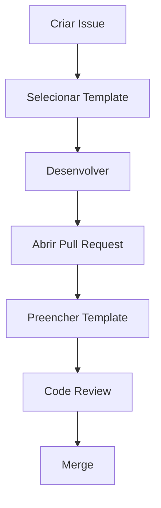

# 📝 Templates

> Este documento reúne os templates oficiais utilizados pela equipe para padronizar o registro das atividades e o processo de revisão de código.
>
> O objetivo é garantir que todas as informações necessárias para o desenvolvimento, acompanhamento e validação das entregas sejam registradas de forma consistente.

---

# Sumário

1. Como utilizar os templates
2. Campos comuns
3. Templates de Issues

   * 3.1 Feature Request
   * 3.2 Bug Report
   * 3.3 Task
   * 3.4 Documentation
   * 3.5 Performance
   * 3.6 Security
   * 3.7 Test
4. Template de Pull Request
5. Registro de Horas
   * 5.1 Estrutura do Pull Request
   * 5.2 Checklist obrigatório
   * 5.3 Quando utilizar Draft Pull Request
   * 5.4 Evidências
6. Boas práticas

---

# 1. Como utilizar os templates

Os templates têm como objetivo padronizar a criação de artefatos utilizados durante o desenvolvimento.

Ao utilizar um template, todas as informações importantes ficam registradas de maneira uniforme, facilitando:

* planejamento das atividades;
* desenvolvimento;
* acompanhamento do progresso;
* Code Review;
* geração de métricas;
* onboarding de novos integrantes.

> ℹ️ **Importante**
>
> O template deve orientar o preenchimento da atividade, mas não substitui uma descrição clara e objetiva do problema ou da solução.

---

## Quando utilizar um template?

Sempre que uma nova Issue ou Pull Request for criada.

Isso garante que todas as atividades sigam o mesmo padrão de documentação.

| Artefato     | Template obrigatório |
| ------------ | :------------------: |
| Issue        |           ✅          |
| Pull Request |           ✅          |

---

# 2. Campos comuns

Independentemente do tipo de Issue, alguns campos aparecem com frequência nos templates utilizados pela equipe.

A tabela abaixo apresenta a finalidade de cada um deles.

| Campo                      | Obrigatório | Objetivo                                               | Exemplo                                           |
| -------------------------- | :---------: | ------------------------------------------------------ | ------------------------------------------------- |
| **Descrição**              |      ✅      | Explicar claramente a atividade.                       | Implementar autenticação utilizando OAuth 2.0.    |
| **Motivação**              |      ✅      | Justificar a necessidade da atividade.                 | Permitir login utilizando contas Google.          |
| **Critérios de aceitação** |      ✅      | Definir quando a atividade será considerada concluída. | Usuário consegue realizar login com sucesso.      |
| **Fora do escopo**         |      ❌      | Informar o que não será desenvolvido nesta atividade.  | Recuperação de senha não faz parte desta entrega. |
| **Referências**            |      ❌      | Adicionar links úteis, documentos ou protótipos.       | Link para documentação da API.                    |

> ✅ **Boa prática**
>
> Quanto mais objetiva for a descrição da atividade, menor será a necessidade de esclarecimentos durante o desenvolvimento e o Code Review.

---

# 3. Templates de Issues

Cada template possui uma finalidade específica.

Utilizar o template correto facilita a organização do projeto e melhora a qualidade das informações registradas.

---

## 3.1 Feature Request

### Objetivo

Utilize este template quando a atividade representar uma **nova funcionalidade** para o sistema.

Exemplos:

* nova tela;
* novo endpoint;
* nova integração;
* novo relatório;
* novo módulo.

---

### Quando utilizar

* Desenvolvimento de funcionalidades inéditas;
* Evolução do produto;
* Implementação de novos recursos.

---

### Quando **não** utilizar

* Correção de bugs;
* Atualização de documentação;
* Refatoração;
* Melhorias de desempenho;
* Configurações internas.

---

### Estrutura recomendada

| Campo                  | Obrigatório |
| ---------------------- | :---------: |
| Descrição              |      ✅      |
| Motivação              |      ✅      |
| Critérios de aceitação |      ✅      |
| Fora do escopo         |      ❌      |
| Referências            |      ❌      |

---

### Exemplo

```markdown
## Descrição

Implementar autenticação utilizando OAuth 2.0 com GitHub.

## Motivação

Permitir que usuários realizem login utilizando suas contas do GitHub.

## Critérios de aceitação

- Login realizado com sucesso.
- Token JWT gerado corretamente.
- Usuário salvo no banco de dados.

## Fora do escopo

- Login utilizando Google.
- Recuperação de senha.

## Referências

https://docs.github.com/apps/oauth-apps
```

> ✅ **Boa prática**
>
> Descreva a funcionalidade sob a perspectiva do usuário ou da regra de negócio, evitando detalhar a implementação técnica.

---

## 3.2 Bug Report

### Objetivo

Utilize este template para registrar comportamentos incorretos ou inesperados do sistema.

O foco do Bug Report é fornecer informações suficientes para que outro integrante consiga reproduzir o problema.

---

### Quando utilizar

* Erros de execução;
* Exceções;
* Comportamentos inesperados;
* Funcionalidades que deixaram de funcionar.

---

### Quando **não** utilizar

* Novas funcionalidades;
* Refatorações;
* Melhorias de desempenho;
* Atualizações de documentação.

---

### Estrutura recomendada

| Campo                  | Obrigatório |
| ---------------------- | :---------: |
| Descrição do problema  |      ✅      |
| Passos para reprodução |      ✅      |
| Resultado esperado     |      ✅      |
| Resultado atual        |      ✅      |
| Evidências             |      ❌      |
| Ambiente               |      ❌      |

---

### Exemplo

```markdown
## Descrição

Ao realizar login utilizando OAuth, o sistema retorna erro HTTP 500.

## Passos para reprodução

1. Acessar a tela de login.
2. Selecionar "Entrar com GitHub".
3. Autorizar a aplicação.

## Resultado esperado

Usuário autenticado com sucesso.

## Resultado atual

Erro HTTP 500.

## Ambiente

Produção

## Evidências

Imagem do erro e log da aplicação.
```

> ⚠️ **Importante**
>
> Nunca registre informações sensíveis, como senhas, tokens de acesso ou dados pessoais, em um Bug Report.

---

## 3.3 Task

### Objetivo

Utilize este template para atividades técnicas que não representam novas funcionalidades nem correções de bugs.

Normalmente são tarefas de manutenção, infraestrutura ou apoio ao desenvolvimento.

---

### Quando utilizar

* Atualização de dependências;
* Configuração de ambiente;
* Migração de banco de dados;
* Configuração de CI/CD;
* Ajustes internos;
* Automatizações.

---

### Quando **não** utilizar

* Desenvolvimento de novas funcionalidades;
* Correção de bugs;
* Atualização de documentação.

---

### Estrutura recomendada

| Campo                  | Obrigatório |
| ---------------------- | :---------: |
| Descrição              |      ✅      |
| Objetivo               |      ✅      |
| Critérios de aceitação |      ✅      |
| Dependências           |      ❌      |
| Referências            |      ❌      |

---

### Exemplo

```markdown
## Descrição

Configurar pipeline de integração contínua utilizando GitHub Actions.

## Objetivo

Executar testes automatizados a cada Pull Request.

## Critérios de aceitação

- Pipeline criada.
- Testes executados automaticamente.
- Build falhando impede Merge.

## Dependências

Conclusão da configuração do ambiente Docker.

## Referências

https://docs.github.com/actions
```

> ✅ **Boa prática**
>
> Mesmo quando a atividade for exclusivamente técnica, descreva claramente o resultado esperado. Isso facilita o acompanhamento da equipe e reduz ambiguidades durante o desenvolvimento.

---

## 3.4 Documentation

### Objetivo

Utilize este template para criar, atualizar ou corrigir qualquer documentação relacionada ao projeto.

A documentação é considerada parte integrante do software e deve evoluir junto com o código.

---

### Quando utilizar

* Atualização do README;
* Criação de documentação técnica;
* Documentação de APIs;
* Atualização de diagramas;
* Guias de instalação;
* Tutoriais internos;
* ADRs (Architecture Decision Records).

---

### Quando **não** utilizar

* Desenvolvimento de funcionalidades;
* Correção de bugs;
* Refatorações;
* Melhorias de desempenho.

---

### Estrutura recomendada

| Campo                  | Obrigatório |
| ---------------------- | :---------: |
| Descrição              |      ✅      |
| Objetivo               |      ✅      |
| Documentação impactada |      ✅      |
| Referências            |      ❌      |

---

### Exemplo

```markdown id="3mfq6j"
## Descrição

Atualizar a documentação da API de autenticação.

## Objetivo

Documentar os novos endpoints implementados.

## Documentação impactada

- docs/api-autenticacao.md
- README.md

## Referências

OpenAPI Specification
```

> ✅ **Boa prática**
>
> Sempre que uma alteração modificar o comportamento do sistema, avalie se a documentação também precisa ser atualizada.

---

## 3.5 Performance

### Objetivo

Utilize este template quando o objetivo da atividade for melhorar o desempenho da aplicação.

Essas melhorias normalmente não alteram o comportamento funcional do sistema, mas reduzem tempo de resposta, consumo de recursos ou aumentam a escalabilidade.

---

### Quando utilizar

* Otimização de consultas SQL;
* Redução do tempo de resposta;
* Otimização de algoritmos;
* Redução do consumo de memória;
* Diminuição do tamanho do bundle;
* Melhorias de cache.

---

### Quando **não** utilizar

* Correção de bugs;
* Desenvolvimento de novas funcionalidades;
* Refatorações sem ganho de desempenho.

---

### Estrutura recomendada

| Campo                   | Obrigatório |
| ----------------------- | :---------: |
| Descrição               |      ✅      |
| Problema identificado   |      ✅      |
| Resultado esperado      |      ✅      |
| Métricas (antes/depois) |      ❌      |

---

### Exemplo

```markdown id="8sv1kg"
## Descrição

Otimizar consulta responsável pelo dashboard.

## Problema identificado

A consulta possui tempo médio de resposta superior a 4 segundos.

## Resultado esperado

Reduzir o tempo médio para menos de 1 segundo.

## Métricas

Antes: 4,3 s

Depois: 0,8 s
```

> ✅ **Boa prática**
>
> Sempre que possível, utilize métricas objetivas para comprovar o ganho de desempenho obtido.

---

## 3.6 Security

### Objetivo

Utilize este template para registrar atividades relacionadas à segurança da aplicação.

Esse tipo de Issue deve receber tratamento prioritário quando representar risco ao sistema ou aos usuários.

---

### Quando utilizar

* Correção de vulnerabilidades;
* Atualização de dependências vulneráveis;
* Ajustes de autenticação;
* Melhorias de autorização;
* Proteção contra ataques;
* Adequação a requisitos de segurança.

---

### Quando **não** utilizar

* Novas funcionalidades;
* Melhorias de desempenho;
* Refatorações comuns.

---

### Estrutura recomendada

| Campo            | Obrigatório |
| ---------------- | :---------: |
| Descrição        |      ✅      |
| Impacto          |      ✅      |
| Solução proposta |      ✅      |
| Evidências       |      ❌      |

---

### Exemplo

```markdown id="g1bf4q"
## Descrição

Atualizar biblioteca JWT devido à vulnerabilidade identificada.

## Impacto

Possibilidade de exploração por versões vulneráveis da biblioteca.

## Solução proposta

Atualizar para a versão estável recomendada.

## Evidências

CVE-XXXX-XXXX
```

> ⚠️ **Importante**
>
> Vulnerabilidades críticas não devem ser descritas publicamente enquanto a correção não estiver disponível. Sempre siga o processo interno definido pela equipe para tratamento de incidentes de segurança.

---

## 3.7 Test

### Objetivo

Utilize este template para atividades relacionadas à criação, atualização ou melhoria de testes automatizados.

Os testes garantem maior confiabilidade durante a evolução do software e reduzem o risco de regressões.

---

### Quando utilizar

* Testes unitários;
* Testes de integração;
* Testes end-to-end;
* Testes de regressão;
* Aumento de cobertura.

---

### Quando **não** utilizar

* Desenvolvimento de funcionalidades;
* Correção de bugs sem criação de testes;
* Atualização de documentação.

---

### Estrutura recomendada

| Campo                  | Obrigatório |
| ---------------------- | :---------: |
| Descrição              |      ✅      |
| Objetivo               |      ✅      |
| Critérios de aceitação |      ✅      |
| Cobertura esperada     |      ❌      |

---

### Exemplo

```markdown id="ms4d9f"
## Descrição

Criar testes unitários para o módulo de autenticação.

## Objetivo

Garantir o correto funcionamento das regras de login.

## Critérios de aceitação

- Todos os cenários principais testados.
- Cobertura superior a 80%.

## Cobertura esperada

80%
```

> ✅ **Boa prática**
>
> Sempre que uma funcionalidade nova for implementada, considere criar ou atualizar os testes automatizados correspondentes.

---

# 4. Registro de Horas

O registro de horas é obrigatório para todas as atividades executadas pela equipe.

Essas informações são utilizadas para:

* acompanhamento do esforço investido;
* composição do banco de horas;
* geração de métricas;
* planejamento das próximas entregas.

O registro deverá ser realizado **nos comentários da Issue**, utilizando o padrão definido abaixo.

---

## Formato

```text id="6jdr8v"
+2h30m

Implementação da autenticação utilizando OAuth.
```

---

## Regras

* O tempo deverá aparecer na primeira linha do comentário;
* Utilize apenas horas (`h`) e minutos (`m`);
* Cada comentário representa uma sessão de trabalho;
* Após o tempo, descreva resumidamente a atividade realizada.

---

## Exemplos corretos

```text id="kpx9dy"
+45m

Correção da validação do token JWT.
```

```text id="nhazr2"
+1h20m

Implementação do endpoint de autenticação.
```

```text id="l0vxsr"
+3h

Modelagem inicial do banco de dados.
```

---

## Exemplos incorretos

```text id="7n6a1z"
45 minutos

Correção do endpoint.
```

```text id="6l3jzq"
2h30

Atualização da API.
```

```text id="6zkj9i"
120

Implementação do login.
```

---

## Recomendações

* Registre as horas logo após finalizar a sessão de trabalho;
* Evite acumular vários dias em um único comentário;
* Seja objetivo ao descrever a atividade realizada;
* Registre apenas o tempo efetivamente dedicado à execução da atividade.

> ℹ️ **Observação**
>
> O padrão de registro é utilizado por processos automatizados para calcular o tempo investido em cada Issue. Alterações no formato podem impedir a leitura correta dessas informações.

---

# 5. Template de Pull Request

Os Pull Requests representam o mecanismo oficial para integração de alterações ao código-fonte.

Todo Pull Request deverá utilizar o template oficial da equipe, independentemente do tipo de alteração realizada.

O objetivo é fornecer ao revisor todas as informações necessárias para validar a implementação antes do merge.

> ℹ️ **Por que utilizar um template único?**
>
> Independentemente de se tratar de uma funcionalidade, correção ou refatoração, todo Pull Request precisa explicar **o que foi alterado, por que foi alterado e como validar a mudança**. Utilizar um único template reduz manutenção e padroniza o processo de revisão.

---

## 5.1 Estrutura do Pull Request

Todo Pull Request deverá conter as seguintes informações.

| Campo                               |    Obrigatório   |
| ----------------------------------- | :--------------: |
| Descrição                           |         ✅        |
| Tipo de mudanças                    |         ✅        |
| Checklist                           |         ✅        |
| Como testar                         |         ✅        |
| Evidências (prints, vídeos ou logs) | Quando aplicável |
| Contexto adicional/Decisões técnicas | Quando aplicável |
| Pontos de atenção para o revisor    | Quando aplicável |
| Uso consciente de Inteligência Artificial | Quando aplicável | 

---

### Exemplo

```markdown id="1tbpc2"
## Descrição

Criação da autenticação OAuth 2.0.

## Tipo de Mudança

> Marque com `x` todas as opções que se aplicam.

- [ ] 🐛 **Bug fix** — corrige um erro sem quebrar funcionalidades existentes
- [X] ✨ **Nova feature** — adiciona uma funcionalidade sem quebrar as existentes
- [ ] 💥 **Breaking change** — mudança que pode impactar funcionalidades existentes
- [ ] 🎨 **Refatoração / melhoria de código** — sem alteração de comportamento
- [ ] 📝 **Documentação** — apenas mudanças em docs
- [ ] 🧪 **Testes** — adição ou correção de testes
- [ ] 🔧 **Configuração / build** — mudanças em CI, scripts, dependências

## Checklist

> Verifique todos os itens antes de solicitar revisão.

- [X] Meu código segue o padrão de estilo do projeto
- [X] Realizei uma auto-revisão do meu código
- [X] Comentei partes complexas do código (se necessário)
- [X] Minhas mudanças não geram novos warnings ou erros
- [X] Adicionei testes que comprovam o funcionamento da feature/fix
- [X] Todos os testes existentes passam localmente
- [X] Atualizei a documentação (README, wiki, etc.), se necessário
- [X] Variáveis de ambiente novas foram documentadas

## Como Testar

> Descreva o passo a passo para que o revisor consiga testar suas mudanças localmente.

1.Abra o app mobile
2.Coloque as credenciais de admin
3.Tente logar no app 

## Contexto Adicional / Decisões Técnicas

Preferi usar a autenticação OAuth 2.0 por sua segurança e facilidade de uso.

## Uso consciente de Inteligência Artificial

Usei a IA para algumas tarefas pontuais como consultar sintaxes e conceitos, além de pedir ajuda para tomar algumas decisões. Tive diversos aprendizados com isso, por exemplo, sobre o modelo OAuth 2.0.
```

---

## 5.2 Checklist obrigatório

Antes de solicitar o Code Review, confirme que todos os itens abaixo foram atendidos.

| Item                                        | Obrigatório |
| ------------------------------------------- | :---------: |
| Compilação realizada com sucesso            |      ✅      |
| Testes executados                           |      ✅      |
| Código revisado pelo autor                  |      ✅      |
| Documentação atualizada (quando necessário) |      ✅      |
| Issue relacionada corretamente              |      ✅      |
| Branch atualizada                           |      ✅      |

> ⚠️ **Importante**
>
> O Pull Request somente deverá ser marcado como pronto para revisão quando todos os itens obrigatórios estiverem concluídos.

---

## 5.3 Quando utilizar Draft Pull Request

Nem todo Pull Request precisa estar concluído para ser compartilhado.

Quando a implementação ainda estiver em andamento, recomenda-se criar um **Draft Pull Request**.

Isso permite:

* compartilhar o progresso da implementação;
* receber feedback antecipado;
* validar decisões arquiteturais;
* executar a pipeline de CI antes da conclusão da atividade.

O Draft Pull Request deverá ser convertido para um Pull Request comum apenas quando estiver pronto para revisão.

> ✅ **Boa prática**
>
> Prefira abrir um Draft Pull Request cedo, principalmente em funcionalidades grandes. Isso reduz retrabalho e facilita a colaboração entre os integrantes da equipe.

---

## 5.4 Evidências

Sempre que a alteração impactar a interface do usuário ou modificar comportamentos visuais, recomenda-se anexar evidências ao Pull Request.

Exemplos:

* Capturas de tela;
* GIFs;
* Vídeos curtos;
* Logs relevantes;
* Resultados de testes.

Essas evidências facilitam o processo de revisão e reduzem a necessidade de reproduzir manualmente determinados cenários.

---

# 6. Boas práticas

Ao criar Issues e Pull Requests, siga as recomendações abaixo.

* Preencha todos os campos obrigatórios;
* Escreva descrições objetivas e completas;
* Relacione corretamente Issues e Pull Requests;
* Atualize a documentação sempre que necessário;
* Mantenha os templates como fonte de informação para toda a equipe.

> ✅ **Boa prática**
>
> Um bom template reduz dúvidas durante o desenvolvimento, acelera o Code Review e melhora significativamente a rastreabilidade das alterações.

---

# 7. Erros comuns

| Evite                                     | Motivo                                                             |
| ----------------------------------------- | ------------------------------------------------------------------ |
| Criar Pull Requests sem Issue relacionada | Perde rastreabilidade entre planejamento e implementação.          |
| Solicitar revisão sem executar testes     | Aumenta o retrabalho durante o Code Review.                        |
| Não informar como validar a alteração     | Obriga o revisor a descobrir sozinho como testar a funcionalidade. |
| Ignorar o checklist do Pull Request       | Aumenta a chance de integração de alterações incompletas.          |

---

# 8. Fluxo de utilização

O fluxo recomendado para utilização dos templates é apresentado abaixo.



Cada etapa complementa a anterior, garantindo que todas as informações relevantes sejam registradas antes da integração do código.

---

# Referências

* GitHub Issues
* GitHub Pull Requests
* GitHub Issue Forms
* GitHub Pull Request Templates
* GitHub Code Review
* Conventional Commits
* Semantic Versioning


